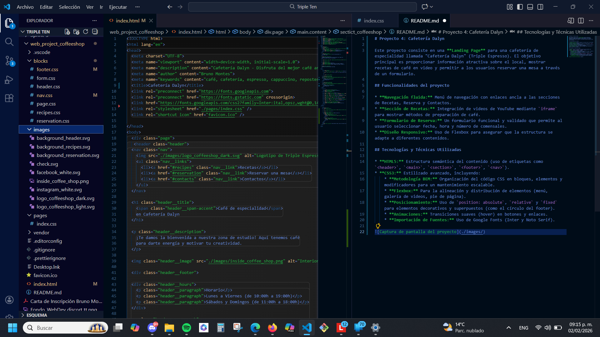

# Proyecto 4: Cafetería Dalyn

Este proyecto consiste en una **Landing Page** para una cafetería de especialidad llamada "Cafetería Dalyn" (Triple Espresso). El objetivo principal es proporcionar información atractiva sobre el local, mostrar recetas de café en video y permitir a los usuarios reservar una mesa a través de un formulario.

## Funcionalidades del proyecto

* **Navegación fluida:** Menú de navegación con enlaces ancla a las secciones de Recetas, Reserva y Contactos.
* **Sección de Recetas:** Integración de videos de YouTube mediante `iframe` para mostrar métodos de preparación de café.
* **Formulario de Reserva:** Un formulario funcional y validado que permite al usuario seleccionar fecha, hora y número de comensales.
* **Diseño Responsivo:** Uso de Flexbox para asegurar que la estructura se adapte a diferentes contenidos.

## Tecnologías y Técnicas Utilizadas

* **HTML5:** Estructura semántica del contenido (uso de etiquetas como `<header>`, `<main>`, `<section>`, `<footer>`, `<nav>`).
* **CSS3:** Estilizado avanzado, incluyendo:
    * **Metodología BEM:** Organización del código CSS en bloques, elementos y modificadores para un mantenimiento escalable.
    * **Flexbox:** Para la alineación y distribución de elementos (menú, galería de videos, pie de página).
    * **Posicionamiento:** Uso de `position: absolute`, `relative` y `fixed` para elementos decorativos y superpuestos (como el círculo del footer).
    * **Animaciones:** Transiciones suaves (hover) en botones y enlaces.
    * **Importación de Fuentes:** Uso de Google Fonts (Inter y Noto Serif).

